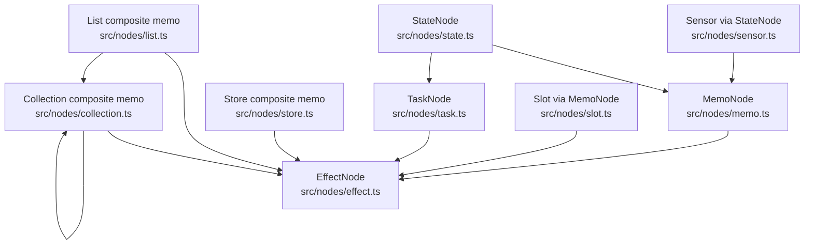
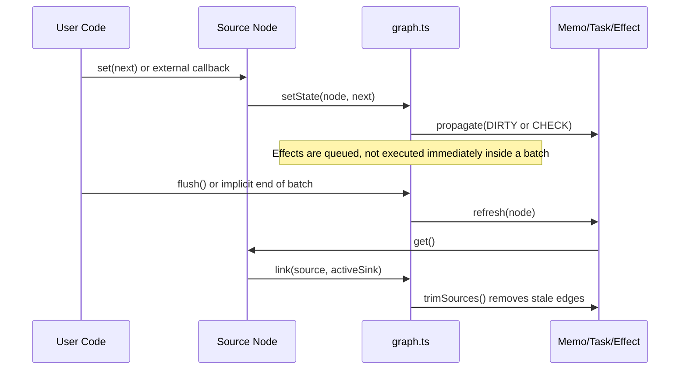

Cause & Effect is built around a directed acyclic signal graph in `src/graph.ts`. Every exported primitive is a thin wrapper over a small number of node shapes: source nodes own values, sink nodes run computations, and some nodes do both. The public API feels high-level, but the implementation stays deliberately small: linked-list edges, dirty flags, lazy recomputation, and explicit cleanup ownership.

## Module Relationships

`src/graph.ts` is the engine. It owns `link()`, `unlink()`, `propagate()`, `refresh()`, `flush()`, `batch()`, `createScope()`, `untrack()`, and `unown()`. All node modules import those helpers and only add type-specific behavior.

- `src/nodes/state.ts` and `src/nodes/sensor.ts` wrap a `StateNode<T>` and delegate writes to `setState()`.
- `src/nodes/memo.ts`, `src/nodes/task.ts`, and `src/nodes/slot.ts` wrap sink-capable nodes and rely on `refresh()` for lazy recomputation.
- `src/nodes/store.ts`, `src/nodes/list.ts`, and `src/nodes/collection.ts` build composite structures on top of child signals plus an internal memo-like node for structural tracking.
- `src/errors.ts` centralizes runtime validation so all factories reject nullish values and invalid callbacks consistently.
- `src/signal.ts` is the ergonomic layer that turns plain values and callbacks into the right signal type with `createSignal()`, `createMutableSignal()`, and `createComputed()`.

## Data Lifecycle

The graph is pull-based for derived values and push-based for invalidation. A write marks downstream nodes dirty, but memos and tasks do not recompute until someone reads them or an effect flushes. This is why `createMemo()` and `createTask()` stay cheap even when many sources change in a batch.

## Key Design Decisions

### Linked-list edges instead of hash maps

The `Edge` structure in `src/graph.ts` stores a connection once and threads it through the source's sink list and the sink's source list. That is why `link()` and `trimSources()` can add and remove dependencies with minimal allocation pressure. The code favors predictable traversal and cheap disposal over a larger abstraction layer.

### Dirty flags instead of eager recomputation

`FLAG_CHECK`, `FLAG_DIRTY`, `FLAG_RUNNING`, and `FLAG_RELINK` let the engine distinguish "something upstream might have changed" from "this node must run now". `propagate()` sends `DIRTY` to direct dependents and `CHECK` transitively, so downstream effects can skip work if equality functions prove the value did not really change. Composite nodes use `FLAG_RELINK` to rebuild child edges safely after structural mutations.

### Ownership is part of the runtime, not a framework concern

`activeOwner`, `registerCleanup()`, `createScope()`, and `unown()` are first-class because integration code needs deterministic disposal. This is especially visible in `src/nodes/effect.ts`, where effects are both reactive sinks and ownership parents. The result is that nested effects, watched callbacks, timers, and custom-element lifecycles can all share one cleanup model.

### Async is a node type, not a convention

`src/nodes/task.ts` uses an internal `pendingNode` plus an `AbortController`. The task value, pending state, and error routing all remain in the same graph. That design is why `match()` in `src/nodes/effect.ts` can distinguish `nil`, `err`, `stale`, and `ok` without separate loading flags.

## How the Pieces Fit Together

Store, List, Collection, and Slot are the most instructive modules because they reuse the same engine differently:

- Store and List create child signals and an internal memo-like node whose `fn` rebuilds the aggregate value from children.
- Collection can be externally driven with `applyChanges()` or derived from a List or another Collection with per-item Memo or Task nodes.
- Slot presents a stable read/write surface while swapping the actual upstream signal underneath it.

In all cases, the graph still sees ordinary edges. The implementation is careful not to invent a second reactivity system for complex data. That is the main architectural advantage of the library: every primitive participates in one engine, so batching, cleanup, equality, and lazy activation behave consistently.
