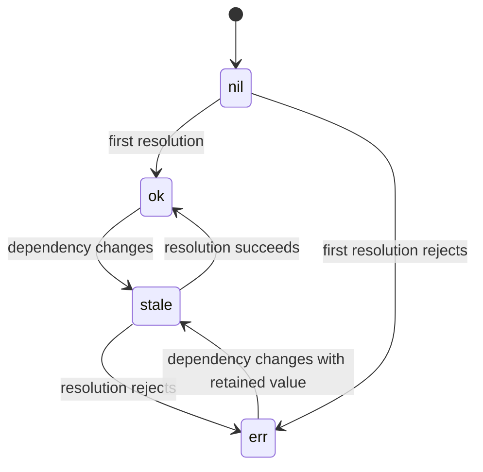

Async work in Cause & Effect is not bolted onto a synchronous system. `createTask()` creates a dedicated async node with cancellation and a reactive pending flag, while `createEffect()` and `match()` give you the side-effect layer that consumes sync and async signals. The relevant source files are `src/nodes/task.ts`, `src/nodes/effect.ts`, and the `recomputeTask()` / `runEffect()` paths in `src/graph.ts`.

## What This Concept Is

A Task is an asynchronous derived signal. It tracks dependencies from the synchronous part of its callback, aborts in-flight work when dependencies change, and retains the previous resolved value while a new run is pending. An Effect is a terminal sink that reacts to changes and optionally registers cleanup work.

## Why It Exists

Most state systems force you to hand-roll loading flags, race cancellation, and stale data handling. This library makes async a first-class graph concept. Because `Task` has its own `AbortController` and `pendingNode`, `match()` can route between `nil`, `err`, `stale`, and `ok` states without extra bookkeeping in user code.

## Internal Mechanics

`createTask()` builds a `TaskNode<T>` plus an internal `StateNode<boolean>` called `pendingNode`. The public `isPending()` method subscribes to that state, which is why stale UI can reactively re-run. In `recomputeTask()` inside `src/graph.ts`, the old controller is aborted, a new controller is created, dependencies are tracked while the callback runs synchronously, and `setState(node.pendingNode, true)` marks the task as pending before the promise resolves.

Effects are queued, not executed inline during propagation. `propagate()` pushes dirty effect nodes into `queuedEffects`, and `flush()` later calls `refresh(effect)` once batching completes. That is how the library avoids repeated effect runs inside a larger transaction.



## Basic Usage

```ts
import { createState, createTask, createEffect, match } from '@zeix/cause-effect'

const userId = createState(1)

const user = createTask(async (_prev, abort) => {
  const response = await fetch(`/api/users/${userId.get()}`, { signal: abort })
  if (!response.ok) throw new Error('Request failed')
  return response.json() as Promise<{ name: string }>
})

createEffect(() => {
  match(user, {
    nil: () => console.log('Loading...'),
    stale: () => console.log('Refreshing...'),
    ok: value => console.log(value.name),
    err: error => console.error(error.message),
  })
})
```

## Advanced Usage

Seed a task with an initial value and expose a stale indicator without clearing the previous value:

```ts
import {
  createState,
  createTask,
  createMemo,
  createEffect,
  match,
} from '@zeix/cause-effect'

const query = createState('books')

const results = createTask(
  async (_prev, abort) => {
    const response = await fetch(`/search?q=${query.get()}`, { signal: abort })
    return response.json() as Promise<{ items: string[] }>
  },
  { value: { items: [] } },
)

const itemCount = createMemo(() => results.get().items.length)

createEffect(() => {
  match(results, {
    stale: () => console.log(`Refreshing ${query.get()} (${itemCount.get()} cached)`),
    ok: value => console.log(value.items),
  })
})
```

You can still use a plain effect for cleanup-based imperative work:

```ts
import { createState, createEffect } from '@zeix/cause-effect'

const visible = createState(true)

createEffect(() => {
  if (!visible.get()) return

  const id = setInterval(() => console.log('tick'), 1000)
  return () => clearInterval(id)
})
```

<Callout type="warn">Do not call `.set()` on reactive state from an async `match()` handler and expect cancellation semantics. The source code in `src/nodes/effect.ts` explicitly treats async handlers as fire-and-forget side effects. If the async work should drive reactive state, model it as a `Task` so cancellation and stale routing stay correct.</Callout>

<Accordions>
<Accordion title="Why `Task` keeps the previous value during re-fetch">
The task node preserves `node.value` when a new run starts and only replaces it after a successful resolution. That design gives you a real stale state, not just loading-or-data. It makes UI and integration logic smoother because downstream memos can keep working with the last good result while a refresh is in flight. The trade-off is that your code must actively branch on `isPending()` or `match(..., { stale })` if showing stale data would be misleading in a given workflow.
</Accordion>
<Accordion title="Why effects are queued instead of run immediately">
If effects ran inline during every `setState()`, a burst of related updates would produce repeated side effects and inconsistent intermediate observations. The queue in `src/graph.ts` lets `batch()` collapse many writes into one flush and ensures effects see the graph after propagation settles. This improves correctness for derived async workflows and composite mutations. The trade-off is that effects are still synchronous relative to the end of a batch, so you should not treat them as a background scheduler or use them for heavy CPU work.
</Accordion>
</Accordions>

See `/docs/guides/async-data-pipelines` for a complete production pattern and `/docs/api-reference/memo-task-effect` for signatures.
