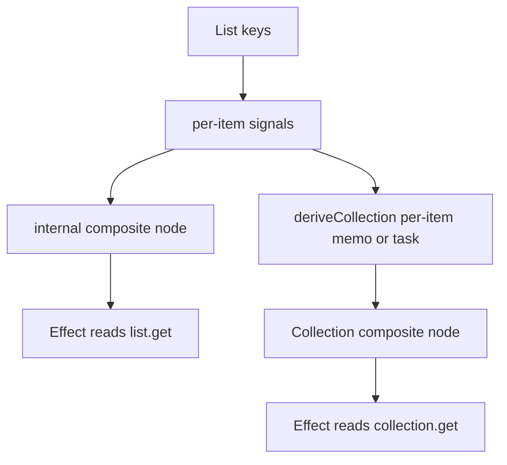

Cause & Effect treats composite data as a first-class problem. `createStore()` turns object properties into nested signals, `createList()` turns arrays into stable keyed item signals, and `createCollection()` models externally-driven or derived keyed sets. Internally, these modules live in `src/nodes/store.ts`, `src/nodes/list.ts`, and `src/nodes/collection.ts`, and they all rely on an internal memo-style node plus `FLAG_RELINK` to keep edges accurate after structural changes.

## What These Concepts Are

- A Store is a proxy-backed reactive object whose properties resolve to `State`, nested `Store`, or `List` signals.
- A List is a mutable ordered collection with stable keys and per-item mutable signals.
- A Collection is a read-only keyed collection for external feeds or derived item-level transformations.

## Why They Exist

Plain object replacement and full-array replacement are too coarse for many reactive applications. You often want a component or effect to subscribe to one property or one item, not the entire aggregate. These composite signals solve that without introducing a separate normalized-store library.

## How They Relate

Store, List, and Collection all share the same graph semantics as State and Memo:

- `store.get()` and `list.get()` rebuild aggregate values from children.
- `store.keys()` and `list.keys()` expose structural subscriptions.
- `list.deriveCollection()` and `collection.deriveCollection()` build per-item Memo or Task nodes over keyed children.
- Collection can also be fed by an external source through `applyChanges()`.

## How They Work Internally

Store and List each maintain a map of child signals plus an internal `MemoNode` whose `fn` rebuilds the aggregate value. They intentionally do not create a second reactive engine. Structural mutations such as `add()`, `remove()`, `splice()`, or key-changing `set()` calls mark the internal node with `FLAG_RELINK`, so the next tracked read rebuilds child edges cleanly.

Collection adds one more layer: its externally driven variant receives `applyChanges(changes)` from `createCollection()`, while its derived variant creates per-item Memo or Task children in `deriveCollection()`. The source code in `src/nodes/collection.ts` uses `syncKeys()` and `ensureFresh()` to preserve keyed identity across derived chains.



## Basic Usage

```ts
import { createStore, createEffect } from '@zeix/cause-effect'

const user = createStore({
  name: 'Alice',
  stats: { visits: 3 },
  tags: ['admin', 'beta'],
})

createEffect(() => {
  console.log(user.name.get(), user.stats.visits.get())
})

user.stats.visits.update(value => value + 1)
user.tags.add('staff')
```

## Advanced Usage

Stable keyed list items are where the library becomes noticeably different from a simple signal wrapper:

```ts
import { createList, createMemo } from '@zeix/cause-effect'

const todos = createList(
  [
    { id: 'a', title: 'Ship docs', done: false },
    { id: 'b', title: 'Review API', done: true },
  ],
  { keyConfig: item => item.id },
)

const openTitles = todos.deriveCollection(item =>
  item.done ? 'done' : item.title,
)

todos.replace('a', { id: 'a', title: 'Ship docs', done: true })
todos.sort((a, b) => a.title.localeCompare(b.title))

console.log(openTitles.get())
```

Externally-driven collections fit streaming or adapter-style integrations:

```ts
import { createCollection, createEffect } from '@zeix/cause-effect'

const messages = createCollection<{ id: string; body: string }>(
  apply => {
    const socket = new WebSocket('wss://example.com/messages')

    socket.addEventListener('message', event => {
      apply({ add: [JSON.parse(event.data)] })
    })

    return () => socket.close()
  },
  { keyConfig: item => item.id },
)

createEffect(() => {
  console.log(messages.get().length)
})
```

<Callout type="warn">Use content-based keys for `createList()` and `createCollection()` whenever items can reorder or be replaced from external data. If you rely on synthetic positional keys and then reorder the array, identity follows the position rather than the logical item, which is correct for index-based lists but wrong for entity lists.</Callout>

<Accordions>
<Accordion title="When to choose Store versus State">
Use `createStore()` when consumers need to subscribe to individual properties or nested branches. The source in `src/nodes/store.ts` recursively turns arrays into `List` and plain objects into nested `Store`, so updates can stay local to the property that changed. A plain `State<object>` is smaller and simpler when you always replace the whole object and always consume it as a whole. The trade-off is that `Store` gives you proxy-based ergonomics and granular reads, while `State` gives you lower conceptual weight for aggregate-only data.
</Accordion>
<Accordion title="When to choose List versus Collection">
Use `createList()` when your code owns the collection and needs mutable methods such as `add`, `remove`, `replace`, `sort`, and `splice`. Use `createCollection()` when some external producer owns the lifecycle or when you are transforming a keyed source with `deriveCollection()`. Collection is intentionally read-only at the top level, which keeps adapter code honest: external systems push mutations through `applyChanges()` instead of arbitrary writes. The trade-off is that `List` is more ergonomic for application-owned arrays, while `Collection` is safer for derived or externally synchronized data.
</Accordion>
</Accordions>

For step-by-step patterns, see `/docs/guides/keyed-collections`. For full signatures, see `/docs/api-reference/store-list-collection`.
