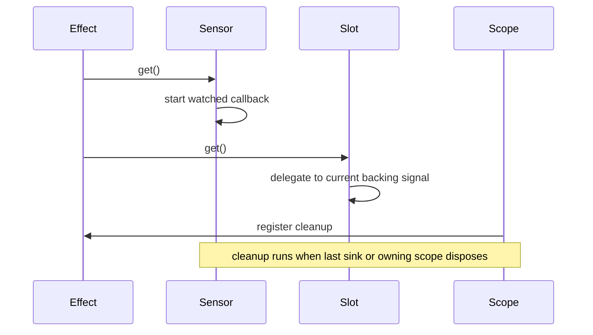

Not every value comes from your own code. Cause & Effect includes three primitives for the edges of the system: `createSensor()` for externally pushed values, `createSlot()` for stable delegated properties, and ownership helpers such as `createScope()` and `unown()` for explicit lifecycle control. These APIs are what make the library practical for custom elements, adapters, and non-framework environments.

## What These Concepts Are

- A Sensor is a lazy, read-only source that starts when the first consumer subscribes and stops when the last one disconnects.
- A Slot is a stable signal surface that can swap its backing signal without breaking downstream subscribers.
- A Scope is an ownership container for nested effects and cleanups, and `unown()` temporarily detaches new owners from the current one.

## Why They Exist

External APIs have their own lifecycles. A `mousemove` listener, `MutationObserver`, `WebSocket`, or custom element property bridge should not stay active forever, and integration layers often need a stable property position even when the backing source changes. These concerns are separate from "reactive state" but still need to participate in the same graph.

## Internal Behavior

`src/nodes/sensor.ts` uses a `StateNode<T>`. When `get()` runs with an `activeSink` present and `node.sinks` is still empty, it starts the watched callback directly for that first consumer. The returned cleanup is stored on `node.stop`, and when the last sink disconnects, `unlink()` invokes that stop handler so the external subscription is torn down lazily.

`src/nodes/slot.ts` wraps a `MemoNode<T>` whose `fn` simply delegates to the current signal or slot descriptor. The important detail is that subscribers link to the slot node, not directly to the delegated source. When `replace(next)` runs, the slot invalidates downstream sinks, and the next refresh rebuilds edges to the new source.

`createScope()` in `src/graph.ts` sets `activeOwner` to a temporary scope object so nested effects register their cleanups there. `unown()` clears `activeOwner` for a callback, which is the escape hatch for DOM-managed lifecycles.



## Basic Usage

```ts
import { createSensor, createEffect } from '@zeix/cause-effect'

const width = createSensor<number>(set => {
  const onResize = () => set(window.innerWidth)
  onResize()
  window.addEventListener('resize', onResize)
  return () => window.removeEventListener('resize', onResize)
})

createEffect(() => {
  console.log(width.get())
})
```

## Advanced Usage

Slots are designed for integration layers that must keep a stable property descriptor:

```ts
import { createState, createMemo, createSlot } from '@zeix/cause-effect'

const local = createState('draft')
const published = createMemo(() => local.get().toUpperCase())
const slot = createSlot(local)

const target: Record<string, unknown> = {}
Object.defineProperty(target, 'title', slot)

console.log((target as { title: string }).title) // draft
slot.replace(published)
console.log((target as { title: string }).title) // DRAFT
```

Ownership helpers matter most for custom elements or imperative adapters:

```ts
import { createScope, createEffect, createState, unown } from '@zeix/cause-effect'

const label = createState('ready')

class StatusBadge extends HTMLElement {
  #dispose?: () => void

  connectedCallback() {
    this.#dispose = unown(() =>
      createScope(() => {
        createEffect(() => {
          this.textContent = label.get()
        })
      }, { root: true }),
    )
  }

  disconnectedCallback() {
    this.#dispose?.()
  }
}
```

<Callout type="warn">If you create a scope from inside a re-runnable effect and that scope is actually owned by the DOM or another external lifecycle, pass `{ root: true }` and usually wrap the call in `unown()`. Otherwise the parent effect will dispose the child scope on its next re-run, which looks like random listener loss.</Callout>

<Accordions>
<Accordion title="When to use Sensor versus Task">
Choose `createSensor()` when an external producer pushes values into the graph, such as DOM events, WebSocket messages, or observer callbacks. Choose `createTask()` when the value should be pulled by a reactive computation from current dependencies and you need cancellation semantics. Sensor is lifecycle-based and callback-driven, while Task is dependency-based and promise-driven. Mixing them is common, but they solve different edges of the system.
</Accordion>
<Accordion title="Why Slot is not a MutableSignal">
A slot forwards reads and writes but does not own a value, so it intentionally has no `update()` method. This keeps the abstraction honest: `replace()` changes which source is delegated to, and `set()` forwards only when the delegated source is writable. The implementation in `src/nodes/slot.ts` even throws `ReadonlySignalError` if the terminal source is read-only. The trade-off is that you get stable integration wiring, but you should still keep a reference to the underlying writable source if you want imperative updates that are clearly local.
</Accordion>
</Accordions>

See `/docs/guides/custom-elements` for a full integration example and `/docs/api-reference/slot` plus `/docs/api-reference/graph-utilities` for signatures.
