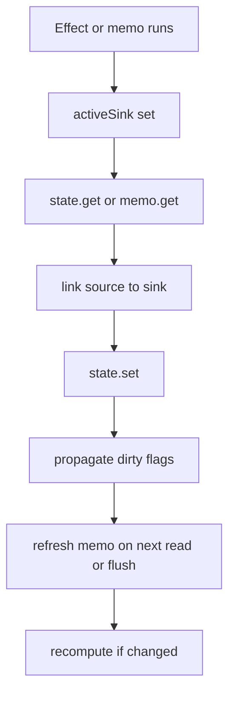

State and derived values are the core of the library. `createState()` owns mutable data, `createMemo()` derives synchronous values from signal reads, and `untrack()` lets you opt out when you need a read that should not become a dependency. Internally, `src/nodes/state.ts` wraps a `StateNode<T>`, while `src/nodes/memo.ts` wraps a `MemoNode<T>` and delegates dependency bookkeeping to `src/graph.ts`.

## What This Concept Solves

This concept exists to solve the basic reactive loop without leaking framework assumptions into your application code. A state write should notify exactly the computations that read it, and a derived value should re-run only when one of those reads changes. Cause & Effect implements that by making `.get()` the dependency declaration and by keeping equality checks on each signal node.

## How It Relates to Other Concepts

- Tasks extend the same idea to async derivation.
- Effects consume state and memo values and run side effects after propagation.
- Store, List, and Collection reuse this exact mechanism under composite wrappers.
- Sensors can feed state-like values from external systems into the same graph.

## How It Works Internally

When you call `state.get()`, `src/nodes/state.ts` checks `activeSink` from `src/graph.ts`. If a memo or effect is currently running, `link(node, activeSink)` creates an edge. When you call `state.set(next)`, `setState()` compares the previous and next values with `equals`, writes the new value, then calls `propagate()` on every dependent sink.

`createMemo()` starts dirty. Its `get()` method calls `refresh(node)`, which eventually runs `recomputeMemo()` in `src/graph.ts`. That function sets `activeSink = node`, executes the memo callback, captures every downstream `.get()`, trims stale dependencies with `trimSources()`, and only marks downstream sinks dirty if the memo result actually changed.



## Basic Usage

```ts
import { createState, createMemo, createEffect } from '@zeix/cause-effect'

const first = createState('Ada')
const last = createState('Lovelace')

const fullName = createMemo(() => `${first.get()} ${last.get()}`)

createEffect(() => {
  console.log(fullName.get())
})

last.set('Byron')
```

## Advanced Usage

Reducer-style memos use the previous value parameter and an initial value from `ComputedOptions<T>`:

```ts
import { createState, createMemo } from '@zeix/cause-effect'

const action = createState<'inc' | 'dec' | 'reset'>('reset')

const counter = createMemo(
  prev => {
    switch (action.get()) {
      case 'inc':
        return prev + 1
      case 'dec':
        return prev - 1
      default:
        return 0
    }
  },
  { value: 0 },
)

action.set('inc')
action.set('inc')
console.log(counter.get()) // 2
```

You can also combine `untrack()` with a memo when one read should not form an edge:

```ts
import { createState, createMemo, untrack } from '@zeix/cause-effect'

const locale = createState('en')
const amount = createState(10)

const label = createMemo(() => {
  const currentLocale = untrack(() => locale.get())
  return `${currentLocale}:${amount.get()}`
})
```

<Callout type="warn">Do not use `createMemo()` as writable state. If your callback depends on its own previous value and also needs imperative writes, use `createState()` or split the concern into a state source plus a memo. Memo callbacks should stay pure and synchronous.</Callout>

<Accordions>
<Accordion title="Why `.get()`-based tracking is better than dependency arrays here">
The engine can only build correct edges if it sees the reads that actually happened. In `src/graph.ts`, `link()` runs during execution, so conditional branches naturally add and remove dependencies over time. That means a memo like `flag.get() ? a.get() : b.get()` stops listening to `a` when the branch switches to `b`, which is hard to express with manual dependency lists. The trade-off is style: developers must treat `.get()` as the reactive boundary and avoid hidden reads inside unrelated helpers when they do not want subscriptions.
</Accordion>
<Accordion title="Why equality functions matter">
Every state and memo can override `equals`, and `DEFAULT_EQUALITY`, `DEEP_EQUALITY`, and `SKIP_EQUALITY` are exported from `src/graph.ts` for that reason. The default is strict equality, which is cheap and works best when you replace immutable values. `DEEP_EQUALITY` can stop downstream propagation for structurally identical objects, but it also costs more per write because it recursively inspects arrays and plain objects. If you always want propagation, such as when observing a mutable object reference, `SKIP_EQUALITY` is the correct tool even though it gives up memo-style change suppression.
</Accordion>
</Accordions>

For the exact signatures, see `/docs/api-reference/state-sensor`, `/docs/api-reference/memo-task-effect`, and `/docs/api-reference/graph-utilities`.
